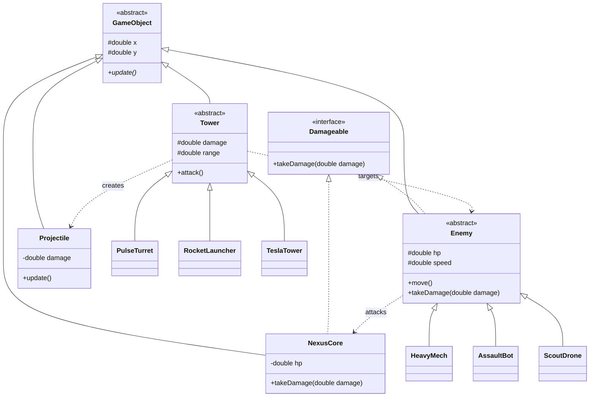

```mermaid
classDiagram
    class GameObject {
        <<abstract>>
        #double x
        #double y
        +update()*
    }

    class Damageable {
        <<interface>>
        +takeDamage(double damage)
    }

    class Enemy {
        <<abstract>>
        #double hp
        #double speed
        +move()
        +takeDamage(double damage)
    }

    class Tower {
        <<abstract>>
        #double damage
        #double range
        +attack()
    }

    class Projectile {
        -double damage
        +update()
    }

    class NexusCore {
        -double hp
        +takeDamage(double damage)
    }

    class ScoutDrone
    class AssaultBot
    class HeavyMech

    class PulseTurret
    class RocketLauncher
    class TeslaTower

    GameObject <|-- Enemy
    GameObject <|-- Tower
    GameObject <|-- Projectile
    GameObject <|-- NexusCore

    Enemy <|-- ScoutDrone
    Enemy <|-- AssaultBot
    Enemy <|-- HeavyMech

    Tower <|-- PulseTurret
    Tower <|-- RocketLauncher
    Tower <|-- TeslaTower

    Damageable <|.. Enemy
    Damageable <|.. NexusCore

    Tower ..> Enemy : targets
    Tower ..> Projectile : creates
    Enemy ..> NexusCore : attacks
```
